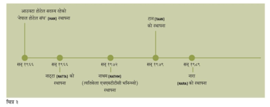
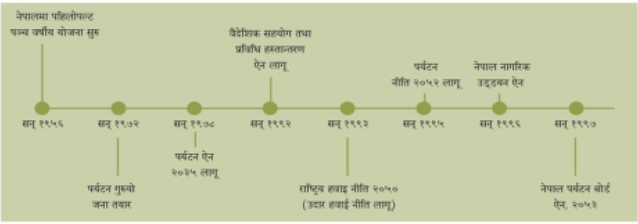
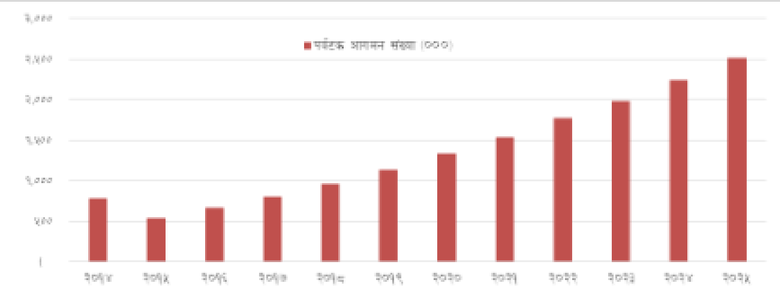

## नेपालमा पर्यटन उद्योग

## पृष्ठभूमि

पर्यटक एक प्रकारको यात्री हो, जो मनोरन्जन तथा फुर्सदको क्षणलाई उपयोग गर्न यात्रामा निस्किएको हुन्छ । जब  यसरी हुने यात्रालाई व्यवस्थित र व्यवसायिक रूप दिइन्छ, त्यसलाई पर्यटन व्यवसाय भनिन्छ । पर्यटनको परिभाषा दिने  क्रममा विश्व पर्यटन संगठनले यात्राका क्रममा आफ्नो सामान्य वातावरणभन्दा अन्य स्थानमा पुग्ने र घुम्ने  अवस्थालाई पर्यटन मानेको छ । ष्   पर्यटन विश्वभर एक आरामदायी गतिविधिका रूपमा लोकप्रिय छ । विश्वका धेरै  मुलुकहरूको अर्थतन्त्र पर्यटनमा आधारित छ । खासगरी सेवा उद्योगतर्फ पर्यटनले अर्थतन्त्रमा सबैभन्दा ठूलो योगदान  गरिरहेको छ । संयुक्त राष्ट्र संघले पर्यटनलाई तीन विभिन्न वर्गमा विभाजन गरेको छ । जसअनुसार आन्तरिक पर्यटन,  आउटबाउण्ड पर्यटन (देशबाहिर घुम्न जाने) र अन्तरराष्ट्रिय पर्यटन (विदेशी पर्यटक मुलुकभित्र आउने) गरी पर्यटनको  वर्गीकरण गरेको छ ।  

संयुक्त राष्ट्र संघीय विश्व पर्यटन संगठन (यूएन–डब्लूटीओ)का अनुसार सन् २०१६ मा विश्वभर १ अर्ब २३ करोड ५०  लाख मानिसले घुमफिर गरेका छन्, यसमध्ये युरोपले ५० प्रतिशत, एसिया प्रशान्तले २५ प्रतिशत,  अमेरिकी महादेशले  १६ प्रतिशत, अफ्रिकाले ५ प्रतिशत र मध्यपूर्वले ४ प्रतिशत हिस्सा ओगट्छ । पर्यटनले विश्व अर्थतन्त्रको १० प्रतिशत  हिस्सा ओगट्दछ । विश्वका उत्कृष्ट पाँच पर्यटक गन्तव्यमा फ्रान्स ( ८ करोड ४५ लाख), अमेरिका (७ करोड ७५  लाख), स्पेन (६ करोड ८५ लाख), चीन (५ करोड ६९ लाख) र इटाली (५ करोड ७ लाख) रहेका छन् । विश्वका  सर्वाधिक पर्यटन खर्चालू मुलुकहरूमा चीन (२६१ अर्ब अमेरिकी डलर), अमेरिका (१२२ अर्ब अमेरिकी डलर), जर्मनी ( ८१ अर्ब अमेरिकी डलर) र युके ( ६४ अर्ब अमेरिकी डलर) र फ्रान्स (४१ अर्ब अमेरिकी डलर) रहेका छन् । 

## इतिहास

धनी मानिसहरूले विश्वभर बनेका भौतिक सम्पदा, प्राकृतिक अवस्थिति, फरक संस्कृति र खानाको स्वाद चाख्ने  मनसायसँगै निकै लामो समयदेखि घुमघामको प्रचलन बसाएका थिए । विश्वमा रोमन राज्य अस्तित्वमा रहेको  अवस्थादेखि नै घुमघाम गर्ने प्रचलन सुरु भएको हो । व्यवस्थित पर्यटनका दृष्टिकोणबाट भने पर्यटन शब्दको प्रयोग  सन् १८१० को दशकताका भएको मानिन्छ । यसलाई व्यवस्थित रूपमा लिपिबद्ध गर्ने काम भने लिग अफ नेशन्स,  संयुक्त राष्ट संघ र अमेरिकालगायत मुलुकले गरेका हुन् ।  

## नेपालमा व्यवस्थित पर्यटन

वि.सं. २००७ साल (सन् १९५१) पछि मात्र नेपाललाई विदेशी पर्यटकका लागि खुला गरिएको हो। ष्ष्  यसअनुसार नेपालमा  पर्यटन उद्योगको व्यवस्थित शुरुवात भएकै साढे ६ दशक नाघिसकेको छ । नेपालमा पर्यटन विकासको विधिवत प्रयास  सन् १९५५ (वि.सं २०११ साल) देखि भएको हो । नेपालको प्रथम पञ्चवर्षीय योजनाको सुरूवातसँगै पर्यटन विकासका  लागि जोड दिन थालिएको थियो । त्यस योजनाले पर्यटन विकासमा नयाँ नयाँ अवसर पहिचान र पर्यटन पूर्वाधार 

स

विकासमा जोड दिएको थियो ।  नेपालमा पहिलो पटक सन् १९७२ (वि.सं २०२९) मा नेपालको प्रथम पर्यटन  गुरूयोजना बनाइएको थियो ।
विकासमा जोड दिएको थियो ।  नेपालमा पहिलो पटक सन् १९७२ (वि.सं २०२९) मा नेपालको प्रथम पर्यटन  गुरूयोजना बनाइएको थियो ।  

“नेपालमा विसं २००७ सालको राजनीतिक परिवर्तनपछि फाट्टफुट्ट पर्यटक आउन थालेका थिए । त्यसपछि सरकारले  २००८ सालमा विदेशी नागरिकलाई नेपालमा भ्रमणको अनुमति दिन सुरु गरेको हो । त्यसबेलादेखि नै विदेशीहरू  नेपाल आउने र घुमघाम गर्ने क्रम प्रारम्भ भयो । जब नेपालमा पर्वतारोहणको क्षेत्रमा सफलता पायो, त्यो क्षण नेपाली  पर्यटनका लागि कोशेढुंगा सावित भएको हो । १६ जेठ २०१० (२९ मे १९५३) मा तेन्जिङ नोर्गे शेर्पा र सर एडमन्ड  हिलारीले सगरमाथाको चुचुरो चुमिसकेपछि नेपाल विश्वभर चर्चित भयो । त्यसपछि भने नेपालमा प्याकेज बिक्री गरी  पर्यटन ल्याउने गरी व्यावसायिक गतिविधि प्रारम्भ भएको हो” : वसन्तराज मिश्र, वरिष्ठ पर्यटन व्यवसायी  

“नेपालमा व्यवस्थित पर्यटनको आधार नै साहसिक पर्यटन हो” : प्रचण्डमान श्रेष्ठ, पर्यटनविज्ञ  

## पर्यटन क्षेत्रको प्रारम्भिक विकासक्रम (सन् १९४७ देखि १९६७ सम्म)
Se Se" Be tT se SE Pe? eT ee eee Oe Te Oe SS Oe PS, कि Se गज SSS गछ फि गाह

ET  eS  ee Se

Sarees viet pea

viet feet आगागे fee ese feet र होन्जङ set  ee ee ना  et aes ee डतको

(t= ]
तालिका साभार : नेपालको राष्ट्रिय पर्यटन रणनीतिक योजना (सन् २०१६–२०२५) 

<!-- image -->

सन् १९६० पछि भने नेपालमा निजी क्षेत्रका व्यवसायीले पर्यटनलाई अगाडि बढाउन महत्वपूर्ण योगदान गरेका थिए ।  नेपालका पर्यटन व्यवसायीहरूको पहिलो संगठन होटल सङ्घ नेपाल (हान) हो । त्यसको स्थापना सन् १९६६ मा भएको  हो । सोही वर्ष नेपाल एसोसिएसन अफ टुर्स एन्ड ट्राभल एजेण्ट्स् (नाट्टा)  गठन भएको इतिहास छ ।  

नेपालमा निजी क्षेत्रमा सक्रिय पर्यटकीय संघसंस्था स्थापनाक्रम

तालिका साभार : नेपालको राष्ट्रिय पर्यटन रणनीतिक योजना सन् २०१६–२०२५) 

<!-- image -->

## नेपालमा पर्यटनसम्बन्धी योजना तथा नीति–नियम

म

म

नेपालमा पहिलो पटक वि.सं २०१३ सालमा पञ्चवर्षीय विकास योजना बनेको थियो । यस योजनाले नेपालमा पर्यटन  विकासको सम्भावना र पूर्वाधार विकासको आवश्यकता औंल्याएको थियो । सरकारका तर्फबाट नेपालमा पहिलो पटक  राष्ट्रिय संस्थाको रूपमा ‘पर्यटन विकास बोर्ड’ गठन गरिएको थियो । यसको गठन सन् १९५७ (२०१४ साल)मा भएको  हो । सन् १९५८ (२०१५ सालमा) मा तत्कालनि ‘शाही नेपाल वायुसेवा निगम’ (हालः नेपाल वायुसेवा निगम) को  स्थापना भएको थियो भने सन् १९५९ (२०१६ साल)मा ‘पर्यटन विभाग’ खुलेको थियो । सन् १९७८ (२०३५ साल)मा  नेपालकै पहिलो ‘पर्यटन ऐन’ बनाइएको हो ।  

## पर्यटन नीति, ऐन तथा योजना विकासक्रम

<!-- image -->

तालिका साभार : नेपालको राष्ट्रिय पर्यटन रणनीतिक योजना सन् २०१६–२०२५) 

## योजना र संगठन स्थापनाका केही महत्वपूर्ण मिति र ऐन–नियम

-    १० वर्षे पर्यटन गुरूयोजना निर्माण : सन् १९७२ (२०२९ साल)  
-    पर्यटन मन्त्रालयको स्थापना : सन्
-    पर्यटन मन्त्रालयको स्थापना : सन् 
-    पर्यटन ऐन (२०३५)  
-    नेपाल नागरिक उड्डयन ऐन २०५३
-    नेपाल पर्यटन बोर्ड ऐन, २०५३  
-    अध्यागमन ऐन, २०४९ 
-    गैर सैनिक हवाई उडान (सिभिल एभिएशन) ऐन, २०१५  
-    नेपाल वायुसेवा निगम ऐन, २०१९ 
-    नेपाल नागरिक उड्डयन प्राधिकरण ऐन, २०५३ 

## नीतिहरू

-    हवाई नीति २०६३
-    पर्यटन नीति २०६५  
-    राष्ट्रिय संस्कृति नीति, २०६७  

१९७६ (२०३३ साल) 

## ऐनहरू

रू

रू

रू 

## रणनीतिक योजनाहरू

-    सन् २००९ (२०६६ साल) : पर्यटनको दीर्घकालीन दृष्टिकोण (‘टुरिजम भिजन’) २०२० 
-    सन् २०१६ (२०७३ साल) : नेपालको राष्ट्रिय पर्यटन रणनीतिक योजना सन् २०१६–२०२५)

## नियमावलीहरू

-    नागरिक उड्डयन सुरक्षा नियमावली, २०७३
-    गैरसैनिक हवाई उडान (दुर्घटना जाँच( नियमावली, २०७१
-    पर्वतारोहणसम्बन्धी नियमावली, २०५९  
-    होटल, लज, रेष्टुराँ, बार तथा पथ प्रदर्शक नियमावली, २०३८  
-    ट्राभल तथा ट्रेकिङ एजेन्सी नियमावली, २०६२ 
-    जलयात्रा नियमावली, २०६३  
-    सवारी तथा यातायात व्यवस्था नियमावली, २०५४  
-    क्यासिनो नियमावली, २०७० 
-    गैरसैनिक हवाई उडान नियमावली 
-    नेपाल नागरिक उड्डयन प्राधिकरण नियमावली, २०७० 
-    नेपाल पर्यटन बोर्ड नियमावली, २०५५ 

रू
-    जलयात्रा नियमावली, २०६३
-    पर्वतारोहणसम्बन्धी नियमावली, २०५९  
-    होटल, लज, रेष्टुरेण्ट, बार तथा टूरिष्ट गाइडसम्बन्धी नियमावली, २०३८  

## निर्देशिका/मापदण्ड

-    होटल स्टार्ण्डर्ड, २०७०  
-    पर्यटन उद्योग सेवाप्रवाह निर्देशिका, २०७०  
-    कम उचाईका हिमालको आरोहण अनुमति प्रदान गर्ने सम्बन्धित निर्देशका, २०७२  
-    होमस्टे सञ्चालन निर्देशिका 
-    दूर्गम क्षेत्रका हवाई उडानमा भाडा सहुलियत प्रदान गर्ने सम्बन्धी मापदण्ड २०७३  
-    पर्वतारोहण रोयल्टी बाँडफाँड तथा परिचालन निर्देशिका, २०७०

## नेपालको अर्थतन्त्रमा पर्यटनको योगदान

धुवारहित उद्योगका रूपमा ख्यातिप्राप्त पर्यटन नेपालमा विदेशी मुद्रा आर्जनको एक महत्वपूर्ण मध्यम हो । प्राकृतिक  सम्पदाले भरिपूर्ण नेपालले गन्तब्य विकासमा त्यति धेरै लगानी नगरे पनि नियमित पर्यटक आगमन वृद्धि भइरहेको छ ।  यसबाट नेपालको अर्थतन्त्रले ठूलो लाभ लिइरहेको छ । तर, विश्वसनीय तथ्यांकको अभाव मात्र होइन, पर्यटनमा हुने  हरेक कारोबार औपचारिक प्रणालीबाट हुन नसक्दा यथार्थ चित्र भने प्राप्त हुन सकेको छैन ।  

नेपालमा दुई तहबाट पर्यटक आवागमन हुने गरेको छ, हवाई तथा स्थल मार्ग । सरकारी तथ्यांकले हवाई मार्गबाट  आउने सबै देशका र स्थलमार्गबाट आउने भारतीयबाहेकका पर्यटकको मात्र विवरण देखाउँछ । करिब १८००  किलोमिटर खुला सीमाका कारण मूल नाकाहरूबाहेक अन्यत्रबाट पनि अभिलेखीकरण नगरी ठूलो संख्यामा भारतीय  पर्यटक आउँछन् । त्यसैले नेपालमा पर्यटन उद्योगले अर्थतन्त्रमा प्रुयाएको योगदानबारे सही तथ्यांकको अभाव छ । 

## कूल गार्हस्थ्य उत्पादन (जीडीपी)मा योगदान

वर्ल्ड ट्राभल एण्ड टूरिजम काउन्सिल (डब्लूटीटीसी)ले सन् २०१७ मा गरेको अनुमानअनुसार पर्यटन उद्योगले नेपालको  कूल गार्हस्थ उत्पादनमा ३ दशमलव ६ प्रतिशत प्रत्यक्ष योगदान गरेको छ । तर, नेपालका आन्तरिक तथ्यांकहरूमा भने  यसको योगदान ज्यादै कम देखिएको छ । नेपालमा पर्यटन सेटलाइट लेखाप्रणालीको अभावले यकिन तथ्यांक राख्न  नसकिएको सरकारी निकायहरूले बताएका छन् ।   

स्रोत : संस्कृति, पर्यटन तथा नागरिक उड्डयन मन्त्रालय  

| वर्ष                                 |   २०६८/६९  |   २०६९/७०  |   २०७०/७१  |   २०७१/७२  |   २०७२/७३  |   २०७३/७४  |
|-------------------------------------|------------|------------|------------|------------|------------|------------|
| कुल  गार्हस्थ्य  उत्पादनको  अनुपातमा  ( प्रतिशत) |         २  |         २  |        2.4 |        2.5 |        1.9 |        2.1 |
## रोजगारीमा योगदान

न

वर्ल्ड ट्राभल एण्ड टूरिजम काउन्सिल (डब्लूटीटीसी)को तथ्यांकअनुसार सन् २०१६ मा नेपालमा पर्यटन उद्योगले ४  लाख २७ हजार प्रत्यक्ष रोजगारी सिर्जना गरेको छ । यो कूल रोजगारीको २ दशमलव ९ प्रतिशत हो । पर्यटन रोजगार  सर्भेक्षण २०१४ का अनुसार नेपालमा करिव १ लाख ३८ हजार १ सय ४८ जनाले पर्यटन सेवामार्फत प्रत्यक्ष रूपमा  रोजगारी पाएका छन् । जसमध्ये ८० प्रतिशत पुरुष र २० प्रतिशत महिला छन् । पर्यटनमा रोजगारी सम्बन्धमा नेपाल  सरकारले गरेको यो नै पहिलो सर्वेक्षण हो । 

विदेशी मुद्रा आर्जनमा योगदान 

न
|                                                | eee)  =             |              |
|------------------------------------------------|---------------------|--------------|
|                                                | 4.c]  %,0]  गद      |              |
|                                                | 4.6]  4.4]  6c)     |              |
|                                                | ¥4¥.%)  20.4]  §.0] |              |
| पछी? a उैपेहन त गुड नार २९१  PEL ima  "ee  4.5  4.4 |                     |              |
|                                                |                     | | ee फिड :  | |
: आर्थिक सर्वेक्षण / आर्थिक वर्ष २०७३/७४  

## पर्यटनबाट हुने वैदेशिक आयको प्रक्षेपण (सन् २०२५ सम्म)
Say Sh) Ae So Sa ES | SRT
तालिका साभार : नेपालको राष्ट्रिय पर्यटन रणनीतिक योजना सन् २०१६–२०२५) 

<!-- image -->

पर्यटक प्रवर्द्धनका ठूला अभियान 

न
-    नेपाल भ्रमण वर्ष १९९८  
-    गन्तब्य नेपाल अभियान सन् २००२ र २००३ 
-    पोखरा भ्रमण वर्ष २००७  
-    नेपाल पर्यटन वर्ष २०११
-    लुम्बिनी भ्रमण वर्ष २०१२
-    घुमफिर वर्ष २०७३
-    टूरिजम इयर २०१८ (प्रस्तावित)  

## पर्यटन विकासको सम्भावना

-    प्राकृतिक तथा सांस्कृतिक स्रोत नेपालका मुख्य पर्यटकीय सम्पदा मानिन्छन् ।
-    नेपालका २० वटा संरक्षित क्षेत्रहरूले देशको २३ दशलवम २३ प्रतिशत क्षेत्रफल ओगटेको छ ।
-    नेपालमा हिमालयको मुख्य भागसहित संसारकै सबैभन्दा उच्च हिमश्रृङ्खला अवस्थित छ । विश्वका १४ वटा ८  हजार मिटरभन्दा अग्ला हिमालमध्ये ८ वटा नेपालमा छन् । ७ हजार मिटरभन्दा माथिका मात्र ९० वटा  हिमशिखर यहाँ छन् ।  
-    पर्वतारोहण, पदयात्रा, चट्टान–आरोहण (रक–क्लाइम्बिङ), र प्याराग्लाइडिङलगायत अन्य गतिविधिहरू, कम र  बढी जोखिम हुने साहसिक पर्यटन गतिविधिको प्रमुख स्रोत हिमाल र पहाड मानिन्छ । 
-    सांस्कृतिक र धार्मिक सम्पदा (लुम्बिनी, पशुपतिनाथ, मुक्तिनाथ, जनकपुरलगायत) नेपालको पर्यटनका प्रमुख  आकर्षक सम्पदा हुन् । 
-    नेपाललाई ३ वटा पारिस्थिकीय क्षेत्र (तराई, मध्य पहाड तथा उपत्यका, र उच्च पहाडी क्षेत्र) र ५ वटा जलवायु  क्षेत्रमा विभाजन गरिएको छ । दक्षिणतर्फ करिब १,२०० मिटर उचाइसम्मको क्षेत्रलाई उष्ण हावापानी,  त्यसमाथिको करिब २,४०० मिटर उचाइसम्मको पहाडी भेगमा उपोष्ण हावापानी पाइन्छ, भने २,४०० देखि  ३,६०० मिटरसम्मको भूभागमा समशीतोष्ण हावापानी पाइन्छ । त्यसैगरी ३,६०० देखि ४,४०० मिटरसम्मको  क्षेत्रमा शीतोष्ण हावापानी र त्यसमाथिको क्षेत्रमा अतिशीतोष्ण प्रकारको हावापानी पाइन्छ । समुन्दी सतहबाट  प्रत्येक २० मिटरको उचाईमा फरक फरक वातावरणको अनुभूति गर्न सकिने नेपाल अलौकिक मुलुक हो ।  
-    नेपालमा १ सय १८ प्रकारका पारिस्थिकिय प्रणाली भित्र ३५ प्रकारका वन क्षेत्र अटाएका छन् । नेपालभर करिब  १० हजार प्रजातिका वनस्पति रहेको अनुमान छ। ष्ष्ष्   
-    नेपाल पाटेबाघ, एकसिंगे गैंडा, जंगली हात्ती, अर्ना, घडियाल गोही, सोंस डल्फिन, हिउँचितुवा, कस्तुरी मृग,  भालु, अनेक प्रकारका बाँदरका प्रजाति तथा चौंरीगाईको बासस्थान हो । यहाँ सयौं प्रजातिका चरा तथा पुतली  पाइन्छन् । यहाँ ८ सय ७२ प्रजातिक चरा पाइन्छन्, यो सङ्ख्या विश्वको कूल संख्याको ९ प्रतिशत हो । ष्ख   त्यसकारण नेपाल वाइल्ड लाइफ टूरिजमको महत्वपूर्ण गन्तब्य हो ।  
-    नेपालको पहिलो संरक्षित क्षेत्र चितवन राष्ट्रिय निकुञ्ज हो । यसको घोषणा सन् १९७३ (वि.सं २०३० साल) मा  भएको हो । अहिले भने नेपालमा १० वटा राष्ट्रिय निकुञ्ज, ३ वटा वन्यजन्तु आरक्ष, ६ वटा संरक्षण क्षेत्र र १  शिकार आरक्ष, १२ वटा मध्यवर्ती क्षेत्रर १० वटा रामसार क्षेत्र घोषणा भइसकेको छ । ख   
-     नेपालमा हाल ४ वटा क्षेत्र विश्वसम्पदा सूचीमा सूचीकृत  छन् । त्यसमध्ये २ वटा संरक्षित क्षेत्र (सगरमाथा  राष्ट्रिय निकुञ्ज– सन् १९७९ मा)र चितवन राष्ट्रिय निकुञ्ज– सन् १९८४ मा) सूचीकृत भएका हुन् । २ वटा  साँस्कृतिक क्षेत्र (काठमाडौं उपत्यका– सन् १९७९ मा र  लुम्बिनी क्षेत्र– सन् १९९७ मा) सूचीकृत भएका हुन ।  
-  पदयात्रा
-  पदयात्रा
-    स्काई डाइभिङ
-  बन्जी जम्पिङ
-    पर्वतारोहण 
-  ्रयाफ्टिङ
-    क्यानोइन 
-    माउन्टेन बाइकिङ 
-    माउन्टेन फ्लाइट  
-    हिमाल अबलोकन 
-  जंगल सफारी
-    पुतली अवलोकन 
-  चरा अबलोकन
-    भिलेज टूर
-  धार्मिक यात्रा र दर्शन
-  स्वादिष्ट परिकार
-    मौलिक संस्कृति र होमस्टे 
-    प्याराग्लाइडिङ 
-    अल्टाफ्लाइट  
-    जीप फ्लाइङ  
-  सपिङ

## बढी पर्यटकले भ्रमण गर्ने पर्यटकीय स्थल

अन्नपूर्ण आधार शिविर, ताप्लेजुङ, सगरमाथा आधार शिविर, जनकपुर, इलाम, काठमाडौं उपत्यका,  कीर्तिपुर, बन्दिपुर, तनहुँ, रारा, बर्दिया, नाम्चेबजार, लुम्बिनी, डोल्पा, पाल्पा, पोखरा, राष्ट्रिय निकुन्जहरू,  धार्मिक स्थलहरू, मुस्ताङ, जोमसोम, खप्तड, कैलाली, चितवन, ढोरपाटन, गोसाइकुन्ड, कालिन्चोक,  नगरकोट

ध

## नेपालमा हुने मुख्य पर्यटकीय गतिविधि

ा

सन् २०१६ मा कूल ७ लाख ५३ हजार २ जना पर्यटक नेपाल आएका थिए । सन् २०१५ को तुलनामा १ लाख ७४  हजार ८ सय ३ अर्थात करिव ४० प्रतिशतले बढी हो । सन् २०२० सम्म  १३ लाख ५० हजार र २०२५ सम्म २५  लाख २२ हजार पुग्ने नेपाल सरकारको प्रक्षेपण छ ।
सन् २०१६ मा कूल ७ लाख ५३ हजार २ जना पर्यटक नेपाल आएका थिए । सन् २०१५ को तुलनामा १ लाख ७४  हजार ८ सय ३ अर्थात करिव ४० प्रतिशतले बढी हो । सन् २०२० सम्म  १३ लाख ५० हजार र २०२५ सम्म २५  लाख २२ हजार पुग्ने नेपाल सरकारको प्रक्षेपण छ ।  

## सन् २०२५ सम्मको पर्यटक आगमन प्रक्षेपण

तालिका साभार : नेपालको राष्ट्रिय पर्यटन रणनीतिक योजना सन् २०१६–२०२५

<!-- image -->

पर्यटनका प्रमुख सूचकांक
## पर्यहक आगमन तथा बसाइँ अर्वाधि

| स्थलमार्णबाट पर्यटकको  प्रत्ति पर्यटकको सरदर बसाई अबधि (दिनमा)  पर्यटक संख्याको बार्षिक [सिन्‌)ो २.  | पृर्षटकका आगमन | आगमन संख्या   |
|------------------------------------------------------------------------------------------------------|
| क पिप |  उष्ट३९ट ।  २८३%८१२९ ।  ५०० १०७ ।  झु स 0 ।                                                     |
| २००७ । ४२६७०५ । ३६०७१३ १६%५६९९१२। पुच. ३७२०                                                           |
| २००८ | २००२७७ ३७४६६१ १२५६१६ | ११,७८६ \_श, छाया                                                          |
| क जिरे |  फ्न्एुफ्टट ।  ३७०३०२  पउुत्दुउछ्ु  १३२ ।  पु श्य                                                        |
| चेज्प्‌ए  बिएर्ददछ  हो ई००००  १५६०६७  १२.६७  १०८.२१                                                         |
| २०११ । ७३६२पृ० 8२११ १९०९९४ १३,१२ २२.१०                                                                |
| पि ।  ७ ३०५%२ ।  ्रहएक्ट ।  स्कट डट  भए दा ।                                                              |
| रप्प३े  ७१७६१६  हर इट इट  २०२७  १२,०५१                                                                 |
| र पिहि ।  [कप प्पप्ट ।  आटश्रश्टप  स्फड्पडा्‌क  भए हा |  नन 'हु                                                   |
| १३१३, ।                                                                                              |
| चपिपद | (५४५ उफ ।  प्रपनुप्रदिउ |  १८०४ ३२ ।  15,४ ।  रड                                                  |

- : संस्काोति, पर्यहन तथा नागरिक उड्डयन मन्जालय
- नोट: स्थलमार्गबाट आएका भारतीय पर्यटकहरूको आगमन संख्या यसमा समावेश छैन ।
तालिका साभार : आर्थिक सर्वेक्षण / आर्थिक वर्ष २०७३/७४  

## सन् २०१६ मा बढी पर्यटक आएका प्रमुख पाँच देश र प्रतिशत

| देश     |   पर्यटक संख्या   |   प्रतिशत   |
|--------|---------------|-----------|
| भारत    |       ११८२४९  |      15.7 |
| चीन     |       १०४००५  |      13.8 |
| श्रीलंका   |        ५७५२१  |       7.6 |
| अमेरिका   |        ५३६४५  |       7   |
| बेलायत   |        ४६२९५  |       6.1 |

स्रोत : आर्थिक सर्वेक्षण / आर्थिक वर्ष २०७३/७४  

त

| प्रयोजन         |   पर्यटक संख्या   |   प्रतिशत   |
|---------------|---------------|-----------|
| बिदा/मनोरन्जन/यात्रा |       ४८९४५१  |     65    |
| तीर्थयात्रा        |        ८२८३०  |     11    |
| पर्वतारोहण/पदयात्रा |        ६६४९०  |      8.83 |
| व्यापार          |        २४३२२  |      3.23 |
| कार्यालयसम्बन्धि    |        २१३१०  |      2.83 |
| सभासम्मेलन       |        १२८०२  |      1.7  |
## भूकम्पले पर्यटनमा भूकम्पबाट भएको क्षति

| विवरण                | रकम (रु लाखमा)     |   नोक्सानी संख्यामा   |
|---------------------|-----------------|---------------|
| होटल–रेष्टुराँ            | १६,२९४          |         ८६५   |
| होमस्टे                | १७२०            |          ९५   |
| संरक्षण क्षेत्रका इको लजहरू | ४१५.३           |           २५  |
| पदयात्रा मार्ग           | ४२६.१           |           २५  |
| टुर अपरेटर            | ६.९             |           १५  |
| कूल                  | १८,८६२.८१       |         १००५  |

स्रोत : संस्कृति, पर्यटन तथा नागरिक उड्डयन मन्त्रालय  

## नेपालमा पर्वतारोहण

पर्वतारोहण हिमाली बासिन्दा शेर्पाहरूको परम्परागत पेशा हो । नेपालको उत्तरी क्षेत्र र तिब्बतबीच फैलिएर रहेको  हिमाली श्रृङ्खला वारपार गरेर जीवनयापन गर्ने क्रममा पर्वतारोहणको आरम्भ भएको मानिन्छ । यसको व्यावसायिक  स्वरुप भने पश्चिमा यात्रुहरूले रोमान्चकताको खोजीमा २० पछिको दशकमा हिमाल चढ्न रहर गर्न थालेपछि आरम्भ  भएको हो । 

सन् १९५३ मा सर्वोच्च टाकुरा (८८४८ मि.) आरोहणमा प्राप्त सफलता अगाडि कैयौ पटक असफल प्रयास पनि  भएका थिए । त्यसमध्ये सन् १९२२ मा सात जना शेर्पा सगरमाथा आरोहणमा गए पनि सफल हुन सकेनन र  उनीहरूको निधन भयो । सगरमाथा आरोहणमा सफलता प्राप्त हुनु तीन वर्षअघि नै अन्नपूर्ण हिमाल आरोहणमा  सफलता मिलेको थियो । यी दुई हिमालको आरोहणपछि नेपालको प्रचार–प्रसारमा ठूलो योगदान पुगेको हो । पर्वतारोहण  शूरु भएसँगै नेपालमा व्यवस्थित पदयात्रा समेत प्रारम्भ भएको हो ।  

## नेपालमा आरोहणबारे केही तथ्य र कीर्तिमान

न 

त

-    सन् १९२२ : सगरमाथा आरोहणका लागि गएका ७ जना शेर्पाको निधन, सगरमाथामा निधन भएको पहिलो  घटना
-    सन् १९५३ : २९ मेमा तेन्जिङ नोर्गे र सर एण्डमण्ड हिलारीबाट सगरमाथाको सफल आरोहण 
-    सन् १९७५ : जापानकी जुनको तावेई, उनले १६ मे १९७५ मा विश्वकै पहिलो महिला आरोहीका रूपमा  सगरमाथा चढेकी हुन् ।  
-    सन् १९९३ : २३ अप्रिल १९९३ मा पासाङ ल्हामु शेपाले सगरमाथा आरोहण गरिन् । उनको आरोहीपछि फर्कने  क्रममा सोही दिन निधन भयो ।
-    सन् १९९३ : २३ अप्रिल १९९३ मा पासाङ ल्हामु शेपाले सगरमाथा आरोहण गरिन् । उनको आरोहीपछि फर्कने  क्रममा सोही दिन निधन भयो ।  
-    सन् १९९९ : बिनाअक्सिजन सबैभन्दा लामो समय सगरमाथा चुचुरोमा समय बिताएको कीर्तिमान बाबुछिरी  शेर्पाद्वारा कायम । उनी २१ घण्टा त्यहा “   रहेका थिए । उनका नाममा अन्य धेरै कीर्तिमान बसिसकेका छन् ।   
-    सन् २००० : नेपालकी दोस्रो महिला लाक्पा शेर्पाले १८ मे २००० मा सफल आरोहण गरिन् ।
-    सन् २००१ : तेम्बाछिरि शेर्पा, नेपालको सबैभन्दा सानो उमेर (१६ वर्ष)मा सगरमाथा आरोहण गर्ने कीर्तिमान
-    सन् २००१ : इरिक वीहेनमेयर, पहिलो दृष्टिविहिन आरोही  
-    सन् २००३ : आङछिरिङ शेर्पा, पहिलो पत्रकार, २२ मे २००३ मा आरोहण 
-    सन् २०११ : सरकारी कर्मचारीको एक टोलीद्वारा सगरमाथाको सफल आरोहण । यो टोलीलाई तत्कालीन  सचिव लिलामणी पौडेलले नेतृत्व गरेका थिए ।  
-    सन् २०१४ सम्म २७९ महिला आरोही चुचुरोमा  

## ५ हजार आरोही सगरमाथा शिखरमा

-    २९ मे २०१७ सम्म आइपुग्दा विश्वको सर्वोच्च चुचुरो (८,८४८मिटर) सगरमाथामा मानव पाइला पुगेको ६४  वर्ष पुगेको छ ।  
-    आरोहण यात्राका दौरान अहिलेसम्म ५ हजारभन्दा बढी आरोही सगरमाथा चुचुरोमा पुगेका छन् ।  
-    डिसेम्बर २०१४ सम्म ४ हजार ४ सय २८ जना आरोही सगरमाथा चुचुरोमा पुगेका थिए ।  
-    सन् २०१५ मा भूकम्पका कारण सगरमाथा आरोहण हुन सकेन ।
-    सन् २०१६ मा करिव ४ सय आरोही सगरमाथा चुचुरोमा पुगेका थिए ।
-    सन् २०१७ को बसन्त ऋतुमा ४२ टोलीका ३ सय ७५ आरोही सगरमाथा आरोहणको अभियानमा छन् ।  

## २ सय ५० भन्दा धेरै आरोहीको निधन

-    सन् १९२२ मा ७ जना शेर्पा सहयोगीको निधन भएपछि सगरमाथामा निधन भएका आरोहीको रेकर्ड राख्न शुरु  गरिएको थियो ।  
-    त्यसयता हालसम्म २ सय ५० भन्दा आरोहीको निधन भएको अनुमान छ ।
-    सन् २०१४ र २०१५ मा सगरमाथामा ठूलो मानवीय क्षति भएको थियो । यी दुई वर्षमा सगरमाथामा १६/१६  जनाले ज्यान गुमाएका थिए ।  
-    सन् १९९६ मा १५ जनाले ज्यान गुमाएका थिए ।
-    सन् २०१६ को बसन्त ऋतुमा मात्र ५ जना आरोहीको निधन भएको थियो भने जारी मौसममा आधा दर्जन  आरोही र सहयोगीको निधन भएको छ ।  

## सगरमाथाबाट के लाभ ?

-    नेपालमा खर्चालु पर्यटक भित्राउने महत्वपूर्ण प्रडक्ट पर्वतारोहण हो । 
-    नेपालमा सगरमाथा चढ्न आउने एक आरोहीले एक पटकको नेपाल बसाईमा करीव ३५ देखि ६० लाख  रूपैया “   हाराहारी खर्च गर्छन् ।
-    नेपालमा सगरमाथा चढ्न आउने एक आरोहीले एक पटकको नेपाल बसाईमा करीव ३५ देखि ६० लाख  रूपैया “   हाराहारी खर्च गर्छन् ।  
-    स्प्रीङ सिजन (फागुन–बैशाख)को समयमा सगरमाथा आरोहणमा आउने पर्यटकबाट नेपालले सर्वाधिक आम्दानी  गर्छ  
-    सरकारी रोयल्टीदेखि हवाई भाडा, शेर्पा सहयोगी, खाना–बसाई, होटल खर्च, उपकरण र अक्सिजनजस्ता  आधारभूत आवश्यकतामा धेरै रकम खर्च हुन्छ  
-    सरकारलाई बुझाउने रोयल्टीबाहेक प्रत्येक आरोहीले ४ हजार डलर धरौटी बुझाउनु पर्छ, जुन धरौटी  सगरमाथामा आफुले उत्पादन गरेको फोहोर ल्याएर आएपछि फिर्ता हुन्छ ।   
-    सगरमाथा आरोही औसतः ७० दिन नेपालमा बस्छन्, कूल पर्यटकको औसतः बसाई १३.४ दिन मात्र रहेको छ ।
-    नेपालमा दुई दर्जन कम्पनीले व्यावसायिक रूपमा सफल आरोहणको व्यवस्थापन गरिरहेका छन् । 
-    नेपालमा ३ हजार दक्ष शेर्पा सहयोगी छन्, जसको भरमा विश्वभरका पर्यटक चुचुरो पुग्न सफल हुन्छन् ।  
-    सहयोगीले एक सिजनमा ३ लाख रूपैया “  सम्म आम्दानी गर्छन् ।  
-    नेपालाम पर्वतारोहण क्षेत्रले मात्र करीव ५४ हजार रोजगारी सिर्जना गरेको अनुमान छ ।  
-    पर्वतारोहणबाट वार्षिक औसतः ४० करोड रूपैया “  सम्म राजस्व संकलन हुन्छ । यसमध्ये ठूलो हिस्सा  सगरमाथाको छ ।   

## पर्यटनमा गोल्डेन ट्रयाङ्गल

नेपालको विद्यमान पर्यटन संरचनाअनुसार काठमाडौं एउटामात्र अन्तरराष्ट्रिय प्रवेशद्वार हो । काठमाडौंबाट शुरु हुने  पर्यटकीय गतिविधि पोखरा र भरतपुर (चितवन राष्ट्रिय निकुञ्ज) मा केन्द्रित छ । यी पर्यटकका लागि मूख्य आकर्षण  भएकाले यसलाई ‘गोल्डेन ट्रयाङ्गल’ भनिन्छ । अन्नपूर्ण संरक्षण क्षेत्र र लुम्बिनीलगायत अन्य प्रमुख पर्यटकीय  आकर्षणसमेत यसै त्रिकोण भित्र राखिएको छ । पछिल्लो समय संघिय संरचनाअनुसार सात वटै प्रदेशमा पर्यटकीय  गन्तब्य निर्माण गर्ने कार्यक्रम रहेको छ ।  

## टीम्स कार्ड

ड

नेपालभित्र पदयात्रा गर्ने क्रममा पर्यटकले ट्रेकर्ष इन्फरमेसन म्यानेजमेन्ट सिस्टम (टीम्स) कार्ड अनिवार्य बोक्नुपर्छ ।  खासगरी नेपालको कुन स्थानमा कुन पर्यटकले यात्रा गरिरहेको छ भन्ने थाहा पाइने र आकस्मिक उद्दारमा सहयोग  पुग्ने उद्देश्यले यो कार्ड वितरण गर्न थालिएको हो । भृकुटीमण्डपस्थित पर्यटक सेवा केन्द्र, नेपाल पर्यटन बोर्ड, पोखरा र  टेकिङ एजेन्सिज एसोसिएशन अफ नेपाल (टान)ले खोलेका विभिन्न काउन्टरबाट टिम्सकार्ड वितरण हुदै आएको छ ।  

## टिम्स कार्ड शुल्क

-    ग्रुपमा जाने पदयात्री : १ हजार रूपैया
-    एक रूपमा जाने पदयात्री : २ हजार रूपैयाँ  
-    सार्क मुलुकका पर्यटक समूहमा जाने : ३ सय रूपैयाँ 
-    सार्क मुलुकको पर्यटक एकल रूपमा जाने : ६ सय रूपैयाँ 
-    नेपालस्थित कुटनीतिक नियोगका कर्मचारीलाई शुल्क लाग्दैन ।
- 
- १५ दिनको भिसा : २५ डलर  
- 
- ३० दिनको लागि : ४० डलर  
- 
- ९० दिनको लागि : १०० डलर 

क

त

## निषेधित क्षेत्रका लागि पदयात्रा अनुमति

नेपाल सरकारले उच्च हिमाली जिल्लाका १२ स्थानको पदयात्रालाई निधेषित क्षेत्र घोषित गरी त्यहाँ अनुमतिबिना प्रवेश  गर्न निषेध गरेको छ । यी क्षेत्रको पदयात्रामा जान चाहने पर्यटकले अध्यागमन विभागबाट ट्रेकिङ परमिट लिनु पर्छ ।  यसरी परमिट लिने क्रममा विभागले निश्चित दिनका लागि निश्चित शुल्क लिने गरेको छ ।    

## नेपालका निषेधित क्षेत्र

-  माथिल्लो डोल्पा
-  तल्लो डोल्पा
-    मुस्ताङ  
-    मनास्लु क्षेत्र 
-    मुगु जिल्ला 
-    मनाङ, नर्फु क्षेत्र 
-    दोलखा, गौरिशंकर र लामाबगर  
-    रसुवा 
-    हुम्ला, सिमिकोट र यारी  
-    संखुवासभा  
-    ताप्लेजुङ, कंचनजंघा क्षेत्र 
-    गोर्खा, छेकम्पार र चुनचेत क्षेत्र  

## भिसासम्बन्धी व्यवस्था

नेपालमा पर्यटकको आगमनका लागि भिसा प्राप्ती भने सहज छ । सम्बन्धित मुलुकस्थित नेपाली दूतावास तथा  नेपालमा त्रिभुवन विमानस्थलबाट अनएराइभल भिसा प्राप्त गर्न सकिन्छ । यसबाहेक स्थल मार्गबाट नेपाल प्रवेश गर्ने  प्रवेश बिन्दुहरूबाट पनि भिसा प्राप्त हुन्छ ।  

## पर्यटकले भिसा शुल्कवापत निम्न मुद्रा तिर्न सक्छन्

-    यूरो, स्वीस, फ्रेन्च, पाउन्ड स्टर्लिङ, अमेरिकी डलर, अस्ट्रेलियन डलर, क्यानेडिन डलर, हङकङ डलर, सिंगापुर  डलर र जापानी येन    
-    पर्यटकले क्रेडिट कार्ड, भारतीय र नेपाली मुद्रामा भिसा शुल्क तिर्न सक्दैनन् ।  

## भिसा शुल्क

भारतीय पर्यटकलाई नेपालमा भिसा लिइरहनु पर्दैन । दक्षिण एसियाली मुलुकका पर्यटकका लागि एक वर्षमा एक पटक  निःशुल्क भिसा उपलब्ध हुन्छ । नेपालमा विश्व सम्पदा र राष्ट्रिय निकुन्जहरूको भ्रमणमा पनि पर्यटकले निश्चित शुल्क  तिर्नु पर्छ ।
भारतीय पर्यटकलाई नेपालमा भिसा लिइरहनु पर्दैन । दक्षिण एसियाली मुलुकका पर्यटकका लागि एक वर्षमा एक पटक  निःशुल्क भिसा उपलब्ध हुन्छ । नेपालमा विश्व सम्पदा र राष्ट्रिय निकुन्जहरूको भ्रमणमा पनि पर्यटकले निश्चित शुल्क  तिर्नु पर्छ ।  

## नेपालले अनअराइभल भिसा नदिने देश

-    नाइजेरिया, घाना, जिम्बावे, स्वाजिल्याण्ड, क्यामरुन, सोमालिया, लाइबेरिया, इथियोपिया, इराक, प्यालेस्टाइन र  अफगानिस्थान
-    यी मुलुकका नागरिकले आफ्नो देशस्थित नेपाली दूतावासबाट मात्र भिसा प्राप्त गर्न सक्नेछन् ।  
-    नेपाल आउने सबै मुलुकका पर्यटकले एक वर्षमा बढीमा १ सय ५० सम्म मात्र बस्न सक्छन् ।  

## पर्यटनमा नियमन र संस्थागत विकास

श

स

य

## संस्कृति, पर्यटन तथा नागरिक उड्डयन मन्त्रालय

संस्कृति, पर्यटन तथा नागरिक उड्डयन मन्त्रालय नेपालमा संस्कृति, पर्यटन र नागरिक उड्डयन क्षेत्रको नियमन गर्ने  निकाय हो । मन्त्रालयमातहत पर्यटन विभाग, नेपाल पर्यटन बोर्ड, नेपाल नागरिक उड्डयन प्राधिकरण, नेपाल पर्यटन  तथा होटल व्यवस्थापन प्रतिष्ठान, नेपाल वायुसेवा निगम, पुरातत्व विभाग, पर्वतीय प्रशिक्षण प्रतिष्ठानजस्ता मूख्य  निकाय सञ्चालनमा छन् ।  

## मन्त्रालय स्थापनाको पृष्ठभूमि

नेपालमा विदेशी पर्यटकको आगमन प्रारम्भ भएसँगै पर्यटन क्षेत्रका कार्यक्रमलाई व्यवस्थित ढंगले अगाडि बढाउन  २०१६ सालमा पर्यटन बोर्डको स्थापना गरिएको थियो । वि.सं. २०१८ सालमा निर्माण तथा यातायात मन्त्रालयअन्तर्गत  पर्यटन विभाग गठन गरिएको थियो । सन् १९७२ को पर्यटन गुरुयोजना र प्रशासन सुधार आयोग, २०३२ को  सिफारिसका आधारमा पर्यटनको योजनाबद्ध विकास तथा प्रवर्द्धन गर्ने गरी केन्द्रिय प्रशासनिक निकायमा रूपमा २०३४  सालमा पर्यटन मन्त्रालय स्थापना गरिएको हो । वि.सं. २०३९ सालमा निर्माण तथा यातायात मन्त्रालय अन्तर्गतको  हवाई विभागलाई समेत पर्यटनमा गाभेर पर्यटन तथा नागरिक उड्डयन नामाकरण गरियो ।  

२०५५ सालमा दुई वटा (हवाई र पर्यटन) विभाग खारेज गरी क्रमशः नेपाल नागरिक उड्डयन प्राधिकरण र नेपाल  पर्यटन बोर्डको स्थापना भयो । २०५७ सालदेखि संस्कृति क्षेत्रको कामसमेत गर्ने गरी यस मन्त्रालयको नाम संस्कृति,  पर्यटन तथा नागरिक उड्डयन मन्त्रालय नामाकरण गरिएको हो । २०५५ सालमा खारेज भएको पर्यटन विभाग भदौ  २०७१ बाट भने ब्यूताइएको छ । अहिले नेपाल पर्यटन बोर्ड र पर्यटन विभाग दुवै संस्था छुट्टाछुट्टै भूमिकामा सक्रिय छन्  ।

## मन्त्रालय अन्तर्गतका महाशाखा

-    जनशक्ति व्यवस्थापन तथा पर्यटन प्रवर्द्धन महाशाखा  
-    योजना तथा मूल्यांकन महाशाखा  
-    हवाई उद्योग व्यवस्थापन महाशाखा  
-    हवाई सुरक्षा तथा प्राधिकरण सुपरिवेक्षण महाशाखा  

ा
-    संस्कृति महाशाखा  
-    कानुन महाशाखा  
-    राष्ट्रिय अभिलेखालय
-    राष्ट्रिय संग्रहालय  
-    राष्ट्रिय कला संग्रहालय   
-    नारायणहिटी दरबार संग्रहालय 
-    पोखरा संग्रहालय  
-    स्मारक तथा दरबार हेरचाह कार्यालय भक्तपुर   
-    नेपाल प्रतिलिपि अधिकार रजिष्ट्रारको कार्यालय 
-    नेपाल नागरिक उड्डयन प्राधिकरण  
-    नेपाल वायुसेवा निगम
-  नेपाल पर्यटन बोड
-    नेपाल संगित तथा नाट्य प्रतिष्ठान 
-  नेपाल ललितकला प्रज्ञा प्रतिष्ठान
-  नेपाल प्रज्ञा प्रतिष्ठान
-    सांस्कृतिक संस्थान  
-    पशुपति क्षेत्र विकास कोष
-    लुम्बिनी क्षेत्र विकास कोष 
-    बृहत्तर जनकपुर क्षेत्र विकास परिषद्  
-  मनकामना क्षेत्र विकास समिति
-  पंचांग निर्णायक समिति
-    मेचिवहाडी क्षेत्र प्रवर्द्धन विकास समिति 
-    नेपाल प्रोत्साहन तथा सभा संघ 

## पर्यटन मन्त्रालयमातहत गठन गरिएका विकास समिति

## संस्कृतिअन्तर्गत

-  पाथिभरा क्षेत्र विकास समिति
-    बराह क्षेत्र विकास समिति, चतराधाम   
-    हलेसी महादेवस्थान विकास समिति, हलेसी
-    हनुमानढोका दरबार संग्रहालय विकास समिति
-    बुढानिलकण्ठ क्षेत्र विकास समिति 
-  देवघाट क्षेत्र विकास समिति
-    बौद्धनाथ क्षेत्र विकास समिति 
-    पाटन संग्रहालय विकास समिति 
-    भानु जन्मस्थल विकास समिति
-  तारागाउँ विकास समिति

य

## मन्त्रालय मातहतका अन्य निकाय

## पयर्टनसम्बन्धी समिति
-    नेपाल पर्यटन तथा होटल व्यवस्थापन प्रतिष्ठान 
-  पर्वतीय प्रशिक्षण विकास समिति
-    खप्तड क्षेत्र पर्यटन विकास समिति 
-    राष्ट्रिय ताल संरक्षण तथा विकास समिति 
-    रुरु, रेसुंगा क्षेत्र संरक्षण तथा पर्यटन विकास समिति 
-    मिथिला क्षेत्र पर्यटन प्रवर्द्धन विकास समिति 
-    चिसापानी क्षेत्र पर्यटन प्रवर्द्धन विकास समिति 
-    लुम्बिनी क्षेत्र पर्यटन प्रवर्द्धन विकास समिति 
-    सिमौनगढ क्षेत्र पर्यटन प्रवर्द्धन विकास समिति 
-  विराट क्षेत्र पर्यटन विकास समिति
-    कर्णाली क्षेत्र पर्यटन प्रवर्द्धन समिति 
-    सलहेस क्षेत्र पर्यटन प्रवर्द्धन समिति 
-    मेचीपहाडी क्षेत्र पर्यटन प्रवर्द्धन विकास समिति 

## निजी क्षेत्रको प्रतिनिधित्व गर्ने पर्यटनका सङ्घ–सङ्गठन

-    नेपाल पर्वतारोहण सङ्घ (एनएमए)
-    ट्रेकिङ एजेन्सिज एसोसिएसन अफ नेपाल (टान)
-    नेपाल होटल सङ्घ (हान)
-    नेपाल एसोसिएसन अफ टुर अपरेटर्स (नाटो)
-    नेपाल एसोसिएसन अफ टुर्स एन्ड ट्राभल एजेन्ट्स (नाट्टा)
-    प्यासिफिक एसिया ट्राभल एसोसिएसन– नेपाल च्याप्टर (पाटा)
-    टुरिस्ट गाइड एसोसिएसन अफ नेपाल (टुर्गान)
-    हिमालय उद्धार सङ्घ (एचआरए)
-    नेपाल वायुसेवा सञ्चालक सङ्घ (आयोन)
-    सोसाइटी अफ टुर एण्ड ट्राभल अर्गनाइजेसन (सोट्टो)
-    सेफ्स् एसोसिएसन अफ नेपाल (क्याओन)
-    नेपाल पर्वतीय प्रशिक्षक सङ्घ 
-    रेष्टुराँ एन्ड बार एसोसिएसन अफ नेपाल (रेबान)
-    नेपाल हवाइ खेलकुद सङ्घ (नासा)
-    नेपाल ्रयाफ्टिङ सङ्घ (नारा) 

न
-    टुरिस्ट गाइड एसोसिएसन अफ नेपाल (टुर्गान)  

## पर्यटनमा बढी प्रयोग हुने शब्दको सङ्क्षेपीकृत र विस्तृत रूप

एक्याप  :

अन्नपूर्ण कन्जरभेसन एरिया प्रोजेक्ट (अन्नपूर्ण संरक्षण क्षेत्र परियोजना)

एनटीबीेः

नेपाल पर्यटन बोर्ड (नेपाल टुरिजम बोर्ड)

टिम्स :

टुरिजम इन्फर्मेसन मेनेजमेन्ट सिस्टम 

नाथम :

नेपाल पर्यटन तथा होटल व्यवस्थापन प्रतिष्ठान

## संख्यामा पर्यटन व्यवसाय

- 
- ट्राभल एजेन्सी : ३ हजार ४ सय ४४ वटा दर्ता 
- 
- ट्रेकिङ एजेन्सी : २ हजार ३ सय ६७  
-    ्रयाफिटङ एजेन्सी : ७२ वटा  
-    टूर गाइड अनुमति पत्र : ३ हजार ७ सय १७  
-    ट्रेकिङ गाइड अनुमति पत्र : १३ हजार ४९  
- 
- रिभर गाइड अनुमति पत्र : २ सय ७  

## नेपालमा नागरिक उड्डयन

नेपालमा २००६ सालबाट संस्थागत हवाई सेवा प्रारम्भ भएको इतिहास छ । विश्वमा एक शताब्दी नाघिसकेको हवाई  सेवाको इतिहास नेपालमा पनि ६७ वर्ष पुगिसकेको छ । तत्कालिन शाही नेपाल वायुसेवा निगमका रूपमा शुरु  व्यवसायिक हवाई यात्राको दौडमा आज करिव डेढ दर्जनभन्दा बढी वायुसेवा कम्पनी समावेश भइसकेका छन् ।  

## नेपाल वायुसेवा निगम

तत्कालीन शाही नेपाल वायुसेवा निगम (आरए)को स्थापना १७ असार २०१५ (१ जुलाई १९५८) मा भएको हो । कुनै  बेला निगमसँग आन्तरिक तथा बाह्य उडानमा १९ वटासम्म जहाज थिए । आज निगमसँग आन्तरिकतर्फ ६ र  बाह्यतर्फ तीन वटा जहाज रहेका छन् । निगम निकट भविश्यमा दुई वटा ठूला (वाइडबडी) जहाज किन्ने तयारीमा छ  ।

## नागरिक उड्डयनसम्बन्धी प्रमुख सूचकांक

-    नियमित उडानमा आउने अन्तरराष्ट्रिय वायुसेवा : २५
-    अन्तरराष्ट्रिय उडान गर्ने नेपाली वायुसेवा : ३  
-    द्विपक्षीय हवाई सेवा सम्झौता भएका मुलुक संख्या : ३८  
-    दुईतर्फी हवाई सिट : ८० हजार  

न
-    आन्तरिक वायुसेवा कम्पनी : १९ वटा  
-    नेपालमा रहेका विमानस्थल : ५६ (निर्माणाधीनसहित)  
-    सबै मौसममा सञ्चालन हुने : २४
-    सञ्चालनमा रहेका विमानस्थल : ३३
-    अन्तरराष्ट्रिय विमानस्थल : १  

## नेपालमा सेवा सञ्चालन गर्ने वायुसेवा कम्पनी

स्रोत : नेपाल नागरिक उड्डयन प्राधिकरण 

| हवाईजहाज                                 | हेलिकोप्टर       |
|----------------------------------------|--------------|
| नेपाल वायुसेवा निगम (आन्तरिक–अन्तरराष्ट्रिय )        | एयर डाइनेस्टी    |
| हिमालय एयरलाइन्स (अन्तरराष्ट्रिय )              | अल्टिच्यूड एयर   |
| बुद्ध एयर (आन्तरिक–अन्तरराष्ट्रिय )             | हेलि एभरेष्ट     |
| गोमा एयर (सिंगल र डबल इन्जिन)                | फिस्टेल एयर     |
| सौर्य एयरलाइन्स                            | मनाङ एयर      |
| श्री एयरलाइन्स                             | माउन्टेन हेलिकोप्टर |
| सिम्रिक एयरलाइन्स                           | प्रभु हेलिकोप्टर   |
| सीता एयर                                 | श्री एयरलाइन्स   |
| यति एयर                                 | सिम्रिक एयर     |
| तारा एयर                                 |              |
| एयर काष्ठमण्डप (सिंगल इन्जिन) एओसी नवीकरण  नभएको |              |
| मकालु एयर (सिंगल इन्जिन)                     |              |

नेपालमा अन्तरराष्ट्रियतर्फ औसतः २६ लाख र आन्तरिकतर्फ १२ लाख हाराहारी यात्रु उड्ने गरेको त्रिभुवन  विमानस्थलको तथ्यांक छ । 

## अन्तरराष्ट्रिय उडान गर्ने नेपाली कम्पनी

-    नेपाल वायुसेवा निगम 
-    हिमालय एयरलाइन्स 
-    बुद्ध एयर  

## नेपालमा उडान गर्ने अन्तरराष्ट्रिय वायुसेवा

-    बंगलादेश : विमान बंगलादेश, रिजेन्ट एयरवेज, यूएस बंगला
-    भूटान : ड्रुक एयर, भुटान एयरलाइन  
-    चीन : एयर चाइना, चाइना इस्टर्न, चाइना साउदर्न, सिचुवान एयरलाइन्स
- 
- हङकङ : डा

ड्रागन एयर  

-    भारत : जेट एयरवेज, इन्डियन एयरलाइन्स, इन्डिगो एयरलाइन्स
- 
- कोरिया : कोरियन एयर 
- 
- मलेसिया  : मलेसियन एयर, मालिन्दो एयर, एयर एसिया 
- 

ओमान : ओमान एयर 

- 

सिंगापुर : सिल्क एयर 

-    थाइल्याण्ड : थाइ एयरलाइन्स 
- 

टर्की : टर्किस एयरलाइन्स 

-    यूएइ : एयर अरेविया, इत्तिहाद एयर, फ्लाई दुबई  

## स्रोत : नेपाल नागरिक उड्डयन प्राधिकरण

## राष्ट्रिय गौरवका ठूला विमानस्थल आयोजना

-    त्रिभुवन अन्तरराष्टिय विमानस्थल क्षमता बिस्तार आयोजना 
-    गौतमबुद्ध अन्तरराष्टिय विमानस्थल, भैरहवा 
-    पोखरा क्षेत्रिय अन्तरराष्टिय विमानस्थल
-    दोस्रो (निजगढ) अन्तरराष्टिय विमानस्थल (बारा) 

## आन्तरिकतर्फ नेपालमा भएका कूल हवाई दुर्घटना

-    मानवीय क्षति भएका दुर्घटना : २८
-    मानवीय क्षति नभएका दुर्घटना : २० 
-    मानवीय क्षति भएका हेलिकोप्टर दुर्घटना : १३  
-    मानवीय क्षति नभएका हेलिकोप्टर दुर्घटना : १८  
-    अहिलेसम्म भएका आन्तरिक हवाई दुर्घटनामा परी ३७५ जनाले ज्यान गुमाइसकेका छन् 

## नेपालमा हवाई उद्योग विकासक्रम संक्षिप्तमा

-    सन् १९४९ : ४ सिट क्षमताको बिच एयरक्राफ्ट काठमाडौंको गौचरमा अवतरण, जसमा तत्कालीन भारतीय  राजदुत सरजित सिंह सवार थिए ।  
-    सन् १९५० : हिमालयन एभिएसनबाट काठमाडौं–कोलकत्ता रुटमा पहिलो चार्टर्ड उडान  
- 
-    सन् १९५५ : तत्कालीन राजा महेन्द्रबाट गौचर विमानस्थलको औपचारिक शुभारम्भ गरी त्रिभुवन विमानस्थल  नामाकरण
-    सन् १९५७ : नागरिक उड्डयन विभाग गठन  
-    सन् १९५८ : शाही नेपाल वायुसेवा निगम स्थापना भई राष्ट्रिय–अन्तरराष्ट्रिय उडान प्रारम्भ  
-    सन् १९६० : नेपाललाई अन्तरराष्ट्रिय नागरिक उड्डयन संगठनको सदस्यता प्राप्त 
-    सन् १९६४ : त्रिभुवन विमानस्थलको नाम संशोधन गरी त्रिभुवन अन्तरराष्ट्रिय विमानस्थल बनाइयो 
-    सन् १९६७ : जर्मन कम्पनी लुप्थान्साको बोइङ ७०७ जहाज काठमाडौंमा अवतरण  
-    सन् १९६७ : थाई एयरको सेवा काठमाडौंमा
-    सन् १९६७ : थाई एयरको सेवा काठमाडौंमा  
-    सन् १९७२ : नेपाल वायुसेवा निगमको बोइङ ७२७/१०० जहाज काठमाडौंमा अवतरण  
- 
- सन् १९९० : नयाँ अन्तरराष्ट्रिय टर्मिनल भवनको राजा वीरेन्द्रबाट उद्घाटन  
-    सन् १९९२ : उदार हवाई नीति अवलम्बन, आन्तरिकतर्फ निजी कम्पनीहरू आउने क्रम सुरु  

दघाटन

-    सन् १९९५ : आन्तरिक टर्मिनल भवन उद्घ
-    सन् २००७ : दोस्रो अन्तरराष्ट्रिय विमानस्थल निर्माण गर्ने क्षेत्र तय  
-    सन् २०१३ : नेपाल अन्तरराष्ट्रिय नागरिक उड्डयन संगठन (आइकाओ) को गम्भिर सुरक्षा चासो (एसएससी)  लिस्ट र यूरोपेली यूनियन (इयू)को सुरक्षा सूचि (सेफ्टी लिस्ट(मा प्रयो ।  
-    सन् २०१५ : भैरहवास्थित गौतमबुद्ध अन्तरराष्ट्रिय विमास्थलको शिलान्यास 
-    सन् २०१६ : पोखरा क्षेत्रीय अन्तरराष्ट्रिय विमानस्थलको शिलान्यास  

## नेपालमा होटल उद्योग

ग

स्न १९६० को दशकबाट नेपालमा तारे होटल निर्माण र सञ्चालनको सुरुवात भएको इतिहास छ । नेपालमा  तत्कालीन राजपरिवारको लगानीबाटै स्तरीय होटल सञ्चालनमा आउन थालेका थिए । प्रजातन्त्र स्थापना पछिमात्र  स्वदेशी तथा विदेशी लगानीकर्ताबाट होटलमा लगानी आउन थालेको थियो । सन् २०१६ मा नेपालमा होटल उद्योगले  सेवा सञ्चालनको ५० वर्ष मनाएको छ । सन् १९६६ (२०२३ साल) मा होटल संघ नेपाल (हान)को स्थापना भएको  थिया । सन् २०१६ मै दुई वटा पाँच तारे होटल अन्नपूर्ण र सोल्टीले स्थापनाको ५० वर्ष पुरा गरे । सन् १९६६ सालमा  हान स्थापना हुँदा ८ सदस्य होटल थिए । हालयो संख्या ३ सय हाराहारी पुगेको छ ।  

## नेपालमा सञ्चालित पाँचतारे होटल

-    होटल डेल अन्नपूर्ण 
-    ह्यायात रिजेन्सी काठमाडौं
-    ्रयाडिसन होटल 
-    सांग्रिला होटल 
-    द मल्ल होटल 
-  सोल्टी क्राउन प्लाजा
-    होटल याक एण्ड यति  
-    होटल एभरेष्ट (भूकम्पयता बन्द) 
-    पोखरा ग्राण्ड होटल 
-    फुलबारी रिसोर्ट पोखरा  

## चारतारे होटल

-    होटल शंकर  

ल

##    हिमालय होटल
##    हिमालय होटल

ल

## तथ्यांकमा होटल
qa: Ties Eran
ताललिका साभार : आर्थिक सर्वेक्षण / आर्थिक वर्ष २०७३/७४  

नोट : नेपालमा ५ वटा क्यासिनो, ३ वटा मिनी क्यासिनो र १ वटा अनलाइन ग्यामिङ सञ्चालनमा छन् ।  

## अच्युत पुरी

कार्यरत संस्था : नयाँ पत्रिका दैनिक

सम्पर्क : ९८४९२१६३२३

इमेल :  mबअजगतबष्फिब२नmबष्।िअय  

## i   1: http://www2.unwto.org
## i   1: http://www2.unwto.org

- ii   नेपालको राष्ट्रिय पर्यटन रणनीतिक योजना सन् २०१६–२०२५  
- iii   वनस्पति विभाग २०७२  
- iv   स्रोत : रा.नि तथा वन्यजन्तु संरक्षण विभागको वार्षिक प्रतिवेदन  
- v   स्रोतः राष्ट्रिय निकुञ्ज तथा वन्यजन्तु संरक्षण विभाग, वार्षिक प्रतिवेदन, आ.व. २०७०।७१, वन तथा भूसंरक्षण  मन्त्रालय ।