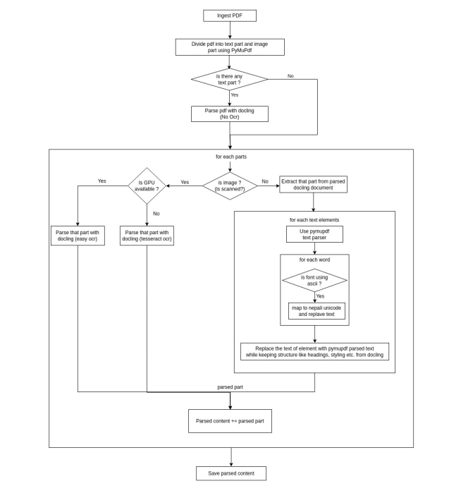

# PDF Parsing Pipeline

## Overview

This repository contains a high-accuracy PDF parsing pipeline designed to convert unstructured PDFs into structured Markdown format. The pipeline supports both Nepali and English languages and effectively handles various types of PDFs, including scanned documents and software-generated PDFs.

## Features
- **Preserves PDF structure**: Converts headings, lists, tables, and text formatting into Markdown.
- **Multi-language support**: Parses both Nepali and English text, converting ASCII-based Nepali fonts into Unicode optionally translated nepali text to english while preserving markdown format.
- **Hybrid approach**: Uses OCR for scanned documents while leveraging direct text extraction for software-generated PDFs.
- **Image extraction**: Processes content embedded within images using OCR.
- **Optimized parsing**: Utilizes PyMuPDF for accurate Nepali text extraction and Docling for layout retention.

## Parsing Approach


### 1. Splitting PDFs into Text and Image Sections
- Each page is analyzed to determine whether it contains text, images, or both.
- Software-generated text is extracted directly, while image-based text requires OCR processing.

### 2. Parsing with Docling (Without OCR)
- Extracts structured content from text regions while preserving Markdown formatting.
- Three approaches considered: parsing the full PDF, splitting PDFs into sections, or manually extracting elements. The third approach was chosen for its efficiency.

### 3. OCR-Based Parsing for Image Sections
- Uses Tesseract or EasyOCR for extracting text from images.
- Extracted text is converted into Markdown while preserving formatting.

### 4. Parsing Text Regions
- Uses Docling and PyMuPDF to extract text, ensuring accurate parsing of Nepali fonts.
- Converts ASCII-based Nepali fonts (e.g., Preeti, Himalli, Kantipur) to Unicode using the `npttf2utf` library.

### 5. Final Markdown Generation
- Combines OCR-based and text-based parsing results.
- Ensures structured, readable Markdown output.

## Challenges
- **Complex layouts**: Parsing issues may arise with non-standard document structures.
- **Text noise**: Some PDFs introduce extra newlines or symbols, requiring further investigation.
- **Coordinate system differences**: Docling and PyMuPDF use different origins (bottom-left vs. top-left), which requires careful handling.
- **OCR accuracy**: Further improvements are needed for better image-based text extraction.

## Installation & Usage

### Installation
```bash
pip install -r requirements.txt
```

### Running the Parser
```bash
python api/main.py
```

FastAPI Server will be started and it can be tested at
`http://127.0.0.1:8000/docs`

## Future Improvements
- Enhance OCR accuracy with advanced models.
- Improve noise filtering in text extraction.
- Optimize processing speed for large documents.

## Contributing
Contributions are welcome! Feel free to submit issues or pull requests.
